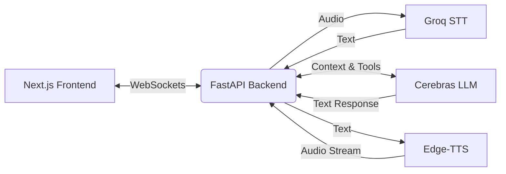

<div align="center">
  <h1>🎙️ Real-Time Voice AI Agent</h1>
  <p><em>A blazing fast, full-stack conversational voice agent with tool-calling capabilities.</em></p>

  [](https://nextjs.org/)
  [](https://fastapi.tiangolo.com/)
  [](https://python.org)
  [](https://cerebras.ai/)
</div>

---

This is a personal/academic project demonstrating a full-stack, real-time conversational voice agent. It features near-instant speech-to-text, LLM reasoning with tool calling, and text-to-speech, all streamed seamlessly over WebSockets.

> **Note on Google Workspace Integrations:** The integrations (Calendar, Gmail, Drive, Sheets) in this project rely on a Google Cloud OAuth app configured in **Testing mode**. It only works with the developer's specific whitelisted test accounts. It is not a multi-tenant production app and cannot be used by the general public without creating your own Google Cloud project and supplying your own `credentials.json`.

---

## ✨ Key Features

- **⚡ Real-Time Voice Streaming:** Next.js frontend capturing microphone audio and streaming it via WebSockets.
- **🧠 Fast Reasoning:** Cerebras Cloud (`llama-3.3-70b` or similar) powers the conversational engine with ultra-low latency.
- **🛠️ Powerful Tools:**
  - 🕰️ **Time & Weather:** Live local time and Open-Meteo weather integrations.
  - 📝 **Reminders & Contacts:** Local JSON-backed reminder scheduling and contact management.
  - 🏢 **Google Workspace:** Search Drive, create Calendar events, draft/send Gmails, and read/write Sheets.
- **🗣️ Instant TTS:** `edge-tts` (Microsoft Edge Read-Aloud API) used for free, high-quality, and fast speech synthesis.
- **👂 Instant STT:** Groq `whisper-large-v3-turbo` for sub-second transcriptions.

---

## 🏗️ Architecture



- **Frontend:** Next.js, React, TailwindCSS, WebSockets.
- **Backend:** FastAPI, Python, Pytest.
- **AI Pipeline:** Groq (STT) ➡️ Cerebras (LLM) ➡️ Edge-TTS (TTS).

---

## 🚀 Getting Started

### Prerequisites
- Python 3.9+
- Node.js 18+
- API Keys from [Groq](https://console.groq.com/) and [Cerebras](https://cloud.cerebras.ai/)

### 1. Clone the Repository
```bash
git clone https://github.com/moazhassan751/real-time-voice-ai-agent.git
cd real-time-voice-ai-agent/voice-agent
```

### 2. Backend Setup
Create and activate a virtual environment (recommended):
```bash
# Windows
python -m venv venv
venv\Scripts\activate

# macOS / Linux
python -m venv venv
source venv/bin/activate
```

Install dependencies:
```bash
pip install -r requirements.txt
```

Configure API keys:
```bash
cp .env.example .env
```
Edit `.env` with your keys:
```env
GROQ_API_KEY=gsk_...
CEREBRAS_API_KEY=csk_...
```

Run the backend server:
```bash
python -m uvicorn server:app --port 8000
```

### 3. Frontend Setup
In a **new terminal**, navigate to the `frontend/` directory:
```bash
cd frontend
npm install
npm run dev
```
Visit `http://localhost:3000` in your browser.

---

## ☁️ Deployment (Free Tier)

This project is configured to be deployed seamlessly using **Render** (for the FastAPI backend) and **Vercel** (for the Next.js frontend). 

### 1. Backend (Render)
1. Sign up for [Render](https://render.com) and create a new **Web Service**.
2. Connect your GitHub repository.
3. Render will automatically detect the `render.yaml` configuration.
4. Go to the Environment section and add all required variables: `CEREBRAS_API_KEY`, `GROQ_API_KEY`, `APP_ACCESS_TOKEN`, `GOOGLE_CLIENT_ID`, `GOOGLE_CLIENT_SECRET`, and `GOOGLE_REFRESH_TOKEN`.
5. Deploy and copy your Render URL (e.g., `https://your-app.onrender.com`).

> [!NOTE]
> Render's free tier spins down your instance after 15 minutes of inactivity. When you connect after it has spun down, it may take 30-40 seconds for the backend to wake up. It is recommended to send a test message a few minutes before a live demo to warm it up.

### 2. Frontend (Vercel)
1. Sign up for [Vercel](https://vercel.com) and create a new project.
2. Connect your GitHub repository.
3. Set the **Root Directory** to `frontend/`.
4. In the Environment Variables section, add:
   - `NEXT_PUBLIC_BACKEND_WS_URL`: Point this to your Render URL but use the Secure WebSocket protocol (e.g., `wss://your-app.onrender.com/ws/chat`).
   - `NEXT_PUBLIC_APP_ACCESS_TOKEN`: The same exact random token you set in your backend.
5. Deploy the frontend and copy the Vercel URL.

### 3. Post-Deployment Security
Once both are live, go to your backend's `server.py` and update the `allow_origins` array in the CORS middleware to specifically allow your Vercel URL (instead of `*`), then push to redeploy the backend.

### 🔐 Sharing Access
You can safely share your Vercel URL (e.g., in Slack or publicly). Since the Google integration uses your personal Google Workspace account, access is gated by the `APP_ACCESS_TOKEN`. 
Share the `APP_ACCESS_TOKEN` separately and privately (e.g., via DM) with anyone you want to grant access to. If a user connects without the token, the frontend will elegantly reject the connection.
